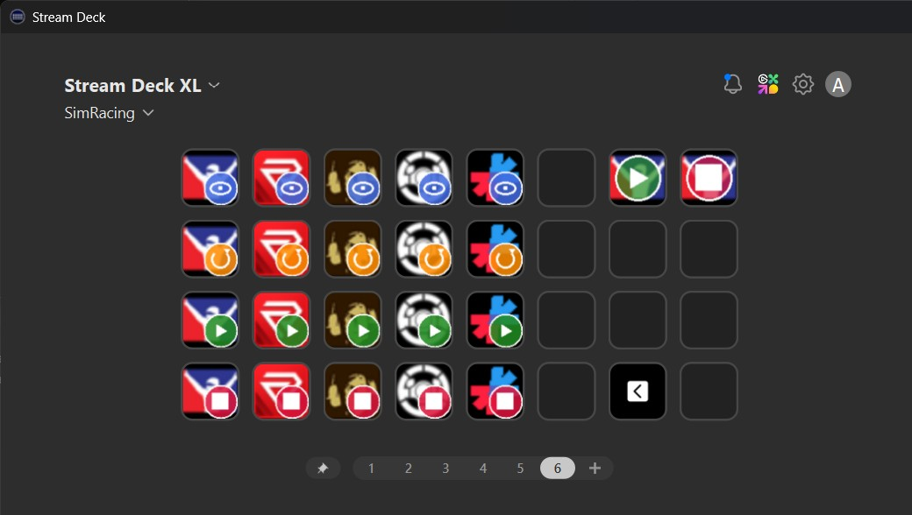
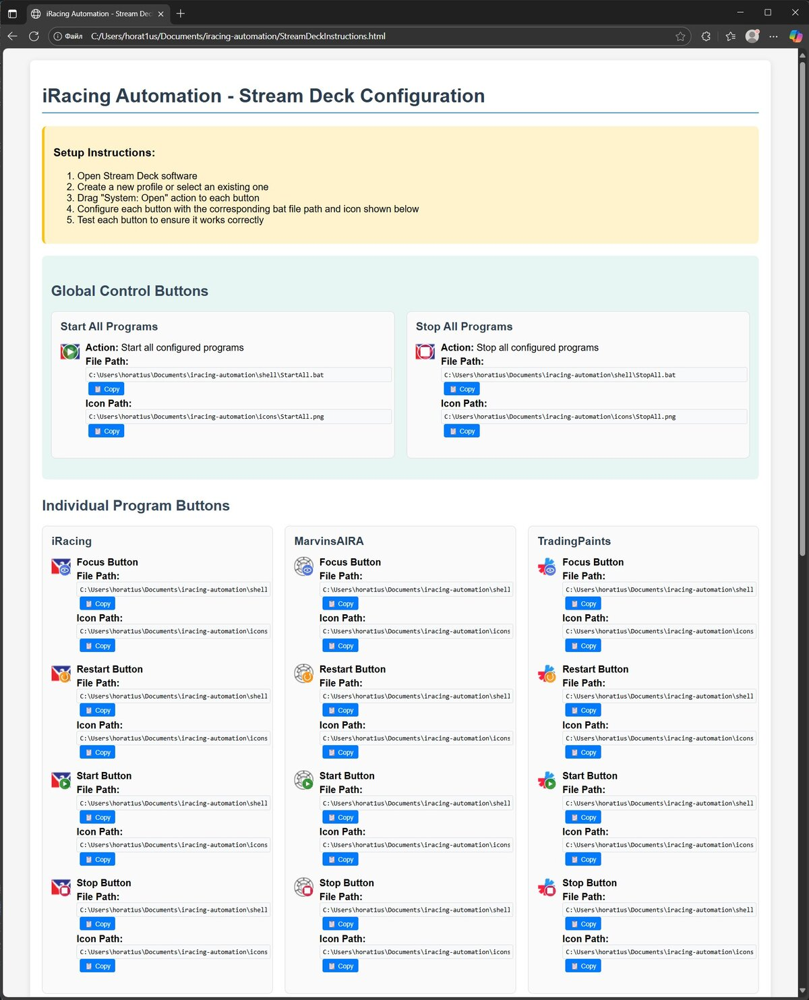

# iRacing Automation

**Streamline your iRacing experience with automated application management and professional Stream Deck integration.**

## What This Project Does

iRacing Automation is a comprehensive toolset that simplifies the management of all your iRacing-related applications through a single, automated workflow. Instead of manually launching each program every time you race, this project automates everything and provides a professional Stream Deck interface:

## Stream Deck Integration Example

The project automatically generates a complete Stream Deck setup with organized buttons for all your iRacing applications. Each program gets individual control buttons (Focus, Restart, Start, Stop) plus global Start All/Stop All controls, complete with custom-generated icons and overlays:



*This is what your Stream Deck will look like after running the installation - fully configured with color-coded action buttons and professional icons extracted from your installed applications.*

### **Core Features:**
- **Automated Application Discovery** - Scans your system for iRacing applications and validates installation paths
- **Professional Icon Generation** - Extracts program icons and creates color-coded overlay variants for different actions
- **Stream Deck Integration** - Generates ready-to-use batch files and provides visual setup instructions
- **Smart Window Management** - Handles programs with dynamic window titles (like Crew Chief and MarvinsAIRA)
- **One-Click Control** - Start all applications, stop all applications, or manage individual programs

### **Stream Deck Benefits:**
- **Visual Button Layout** - Each application gets Focus, Restart, Start, and Stop buttons with distinctive overlay icons
- **Copy-Paste Setup** - Generated HTML guide with copy buttons for easy Stream Deck configuration  
- **Color-Coded Actions** - Blue for Focus, Orange for Restart, Green for Start, Red for Stop
- **Professional Icons** - 144x144 PNG icons with high-contrast overlays optimized for high-resolution displays

### **Supported Applications:**
- **iRacing UI** - The main simulator interface
- **Crew Chief** - Voice spotter and race engineer
- **MarvinsAIRA** - AI-powered race assistant  
- **Trading Paints** - Custom car livery manager
- **Racelab Apps** - Telemetry and race analysis tools
- **+ Any additional applications** you want to include

## Quick Start

### 🚀 Easy Installation (Recommended)

1. **Download the latest release:**
   - Go to [Releases](https://github.com/horat1us/iracing-automation/releases)
   - Download `iRacing-Automation-v*.*.*.zip`

2. **Extract and run:**
   - Extract the ZIP file anywhere on your computer
   - Choose your installation method:
     - **Double-click `iRacing-Automation-Setup.bat`** (recommended - you can inspect the file)
     - **OR double-click `iRacing-Automation-Setup.exe`** (one-click installation)

3. **Follow the prompts:**
   - PowerShell will be installed automatically if missing
   - Your programs will be detected automatically
   - Browser opens with Stream Deck setup guide

### 🛠️ Development Installation

For contributors or advanced users:

1. **Clone the repository:**
   ```bash
   git clone https://github.com/horat1us/iracing-automation.git
   cd iracing-automation
   ```

2. **Run the installation script:**
   ```powershell
   .\scripts\Install.ps1
   ```

## Generated Setup Instructions

The installation automatically creates a comprehensive HTML guide with copy-paste functionality for easy Stream Deck configuration. Each button includes file paths and icon paths with one-click copying:

[](assets/images/html-instructions-screenshot.jpg)

*Click the image above to view the full-size setup instructions - the generated HTML guide provides step-by-step configuration with copy buttons for all file and icon paths.*

## What Install.ps1 Does

- Validates program paths from `config/programs-init.json`
- Prompts for manual path correction if programs aren't found
- Allows adding additional programs interactively
- Generates bat files for Stream Deck integration
- Extracts 144x144 PNG icons from program executables
- Creates HTML setup guide with absolute paths

## Generated Files

After installation:
- `config/programs.json` - Your validated program configuration
- `shell/*.bat` - Stream Deck action files with absolute paths
- `icons/*.png` - Extracted program icons (144x144)
- `StreamDeckInstructions.html` - Visual setup guide
- `logs/install_*.log` - Installation log

## How It Works

### Program Actions Overview
The automation system provides six core actions for managing applications:

#### **Start Operations**
- **Individual Start**: Launches a specific program if not already running
- **Start All**: Launches all configured programs sequentially with 2-second delays
- **Process Detection**: Checks if program is already running before attempting to start
- **Path Validation**: Verifies executable exists before launching

#### **Stop Operations** 
- **Graceful Shutdown**: First attempts `CloseMainWindow()` (3-second timeout)
- **Force Termination**: Uses `Kill()` if graceful shutdown fails
- **Multi-Instance Support**: Handles multiple running instances of the same program
- **Stop All**: Closes all configured programs using the same graceful→force method

#### **Restart Operations**
- **Clean Restart**: Stops the program completely, then starts it fresh
- **Combined Process**: Uses stop logic (graceful→force) followed by start logic

#### **Focus Operations**
- **Window Detection**: Finds windows by title with exact or partial matching
- **Process Validation**: Ensures window belongs to the correct process
- **Window Restoration**: Restores minimized windows before focusing
- **Fallback Method**: Uses process MainWindowHandle if title matching fails

### Technical Implementation

#### Process Management
- **Executable Name Derivation**: Automatically extracts from the first valid path in configuration
- **Process Name Matching**: Removes `.exe` extension for `Get-Process` operations
- **Error Handling**: Continues with remaining processes if individual operations fail

#### Window Management  
- **Exact Title Matching**: Default behavior for programs with static window titles
- **Partial Title Matching**: For programs with dynamic titles (version numbers, status)
- **Multi-Window Support**: Focuses first matching window when multiple exist

#### Configuration Processing
- **Path Resolution**: Tests multiple installation locations in priority order
- **Username Expansion**: Replaces `{USERNAME}` with actual Windows username
- **Validation**: Confirms executable files exist before adding to final configuration

## Available Scripts

- `StartAllPrograms.ps1` - Launch all configured programs
- `StopAllPrograms.ps1` - Close all configured programs gracefully or force-kill if needed
- `StartProgram.ps1 -ProgramName "Name"` - Launch specific program
- `StopProgram.ps1 -ProgramName "Name"` - Close specific program (graceful → force)
- `RestartProgram.ps1 -ProgramName "Name"` - Stop then start specific program
- `FocusWindow.ps1 -ProgramName "Name"` - Focus specific program window

## Contributing - Adding New Programs

**Note for Users**: Regular users don't need to read this section. The `Install.ps1` script automatically generates your `programs.json` configuration file.

**Note for Contributors**: This section explains how to add new programs to the project's `programs-init.json` template file.

When adding new programs to `config/programs-init.json`, follow these guidelines:

### Path Configuration
- **Multiple paths**: Include all common installation locations for the program
- **Username placeholder**: Use `{USERNAME}` as a placeholder for the Windows username
- **Path priority**: List paths in order of likelihood (most common first)

### Example program entry:
```json
{
  "name": "YourProgram",
  "paths": [
    "C:\\Program Files\\YourProgram\\YourProgram.exe",
    "C:\\Users\\{USERNAME}\\AppData\\Local\\Programs\\YourProgram\\YourProgram.exe",
    "C:\\Program Files (x86)\\YourProgram\\YourProgram.exe"
  ],
  "windowTitle": "Your Program Window Title"
}
```

### Path Guidelines:
- **Program Files**: For system-wide installations
- **Program Files (x86)**: For 32-bit programs on 64-bit systems
- **AppData\\Local\\Programs**: For user-specific installations
- **{USERNAME}**: Will be automatically replaced with the actual Windows username during installation

### Window Title Configuration
Some programs have dynamic window titles that include variable information like version numbers or status. For these programs, use partial matching:

#### Programs with Dynamic Window Titles:
- **Crew Chief**: Title changes to "Crew Chief - Active Profile: defaultSettings - Running iRacing"
- **MarvinsAIRA**: Title changes to "Marvin's Awesome iRacing App 1.13.0.0.0" (includes version)

#### Partial Matching Example:
```json
{
  "name": "CrewChiefV4",
  "paths": [
    "C:\\Program Files (x86)\\Britton IT Ltd\\CrewChiefV4\\CrewChiefV4.exe"
  ],
  "windowTitle": "Crew Chief",
  "partialMatch": true
}
```

#### Window Title Guidelines:
- **Exact matching** (default): Use the complete window title for programs with static titles
- **Partial matching**: Set `"partialMatch": true` and use only the beginning portion of the title that doesn't change
- **Focus functionality**: The `FocusWindow.ps1` script will find windows that start with the specified title when `partialMatch` is enabled

## Troubleshooting

### Programs Not Closing Properly
1. **Check Process Name**: Verify executable name matches running process in Task Manager
2. **Multiple Instances**: System handles multiple instances but may need time between operations  
3. **Permissions**: Some programs require administrator privileges to close
4. **Stubborn Processes**: System attempts graceful close (3 seconds), then force-kills

### Window Focus Issues
1. **Title Mismatch**: Enable `partialMatch` for programs with dynamic window titles
2. **Multiple Windows**: Focus targets the first matching window found
3. **Minimized Windows**: System restores minimized windows before focusing

### Installation Issues
1. **Program Not Found**: Use manual path entry during installation if auto-detection fails
2. **PowerShell Execution Policy**: Run `Set-ExecutionPolicy -ExecutionPolicy RemoteSigned -Scope CurrentUser`
3. **Missing Icons**: Some programs may not have extractable icons; functionality still works; 
check logs and  try running Install script again

### Stream Deck Setup Issues
1. **Button Not Working**: Verify bat file path is correct in Stream Deck configuration
2. **Icon Missing**: Check if icon file exists in the icons folder
3. **Permission Denied**: Run Stream Deck as administrator if needed **[not recommended]**

## Requirements

- Windows PowerShell 5.1 or PowerShell Core
- Stream Deck software
- Programs listed in `programs-init.json` (or manual path configuration during install)

## License
[MIT](./LICENSE)
